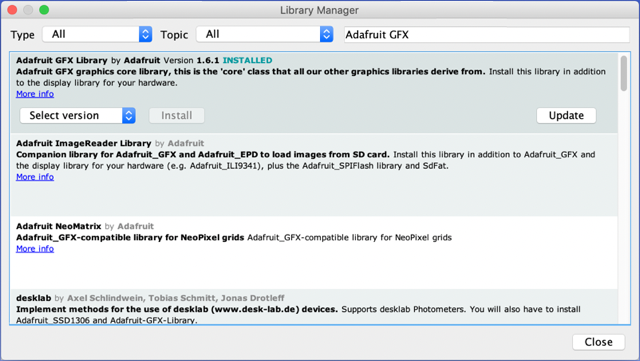
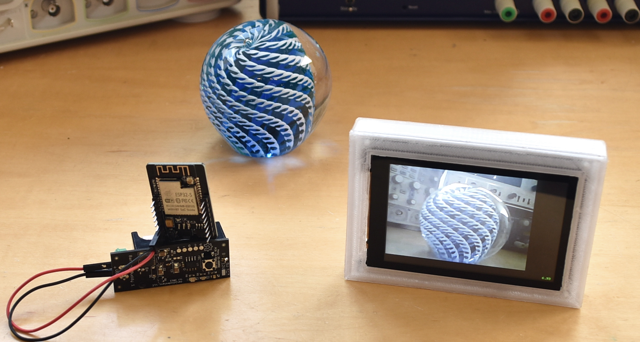
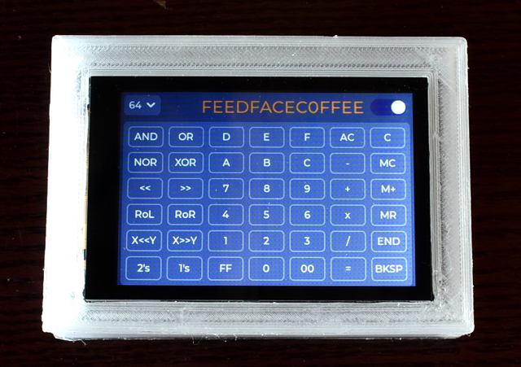
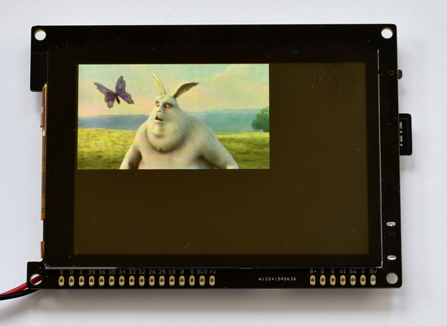
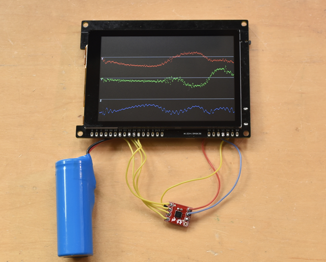
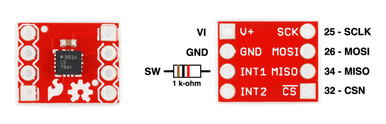

## gCore Arduino Library

### Arduino Library
Copy the ```gCore``` directory into your Arduino libraries folder.  It contains two libraries.

1. ```gCore``` contains a class that interfaces with the EFM8 co-processor and provides control and time functions.
2. ```gCore_ILI9488``` contains an Adafruit compatible display driver for gCore's ILI9488 LCD controller.  It can be used anywhere an Adafruit driver would be used.  It is not as fast as the TFT\_eSPI library but provides a good example of how to interface with the ILI9488, including setup code.

### Other libraries used by gCore demos
There are other libraries, in addition to the gCore libraries, that have been ported to support gCore or are used by the gCore demos.

1. ```Adafruit_FT6206``` (v1.0.6) - Download using Arduino library manager.
2. ```Adafruit_GFX``` (v1.6.1) - Download using Arduino library manager.
3. ```LIFX``` - Use my version downloaded from [here](https://github.com/danjulio/LIFX).
4. ```lv_arduino``` (v3.0.1) - Download using Arduino library manager (see note below).
5. ```Sparkfun_Qwiic_Joystick_Arduino_Library``` (v1.1.1) - Download using Arduino library manager.
6. ```tgx``` - Use my version found in the ```supporting``` directory here (see note below).
7. ```TJpg_Decoder``` (see note below for version) - Download using the Arduino library manager or found [here](https://github.com/Bodmer/TJpg_Decoder).
8. ```TFT_eSPI``` - Use my version downloaded from [here](https://github.com/danjulio/LIFX) (see note below).

### Library notes

#### Arduino Library Manager
To open the Arduino Library Manager, select ```Sketch->Include Library->Manage Libaries...```.



#### LIFX Port
I extended [Peter Hum's](https://github.com/peter-hum/LIFX) excellent ```LIFX``` library to support color capable bulbs as well as to be able to query the bulb and identify it and its capabilities.  The additional functionality is used by the ```lifx_controller``` demo.  Peter's original code won't work with the demo.

#### lv_arduino
The ```lv_arduino``` (LVGL for Arduino) library can be downloaded using the Arduino library manager.  I used v3.0.1 for these demos.  In case a new version breaks these demos, you should be able to download v3.0.1 from [here](https://github.com/lvgl/lv_arduino/releases/tag/3.0.1).

LVGL is configured for a particular project using a ```lv_conf.h``` file located at the top of the library directory.  Among many other things it tells LVGL the display resolution and enables various sizes of the built-in fonts.  The following preconfigured files are included in the ```supporting``` subdirectory here for use with the gCore demos.  The associated file should be copied to the LVGL Arduino library directory and renamed ```lv_conf.h```.

1. ```lv_conf_landscape.h``` is used with ```hex_calculator```.
2. ```lv_conf_portrait.h``` is used with ```lifx_controller```.

#### tgx
Because it appears that Arvind Singh is continuing to evolve his amazing 3D [tgx](https://github.com/vindar/tgx) library, I have included the copy of that library I used for the ```joystick_3d``` demo in case the API changes.  This can be found in the ```supporting ``` subdirectory here.

#### TJpg_Decoder
Install version 0.0.3 of ```TJpg_Decoder``` if you have ESP32 Arduino version 1.X installed.  Install version 1.0.2 if you have ESP32 Arduino version 2.X installed.  This is because Bodmer made changes to the TJpg\_Decoder library that make version 1.0.2 incompatible with version 1.X ESP32 board support packages (see the explanation [here](https://github.com/Bodmer/TJpg_Decoder/issues/30)).

#### TFT_eSPI Port
[Bodmer's](https://github.com/Bodmer/TFT_eSPI) fantastic Adafruit-compatible TFT\_eSPI library is incredibly fast and even though I wrote my own ILI9488 library I'd advise using it when possible.  However it must be configured for each type of display it will use.  My configuration customizations for the ILI9488 LCD controller, gCore specific GPIO pins and 80 MHz SPI operation are found in my [fork](https://github.com/danjulio/TFT_eSPI).  Download and install it as an Arduino library.  You may have to temporarily move aside any other version of TFT_eSPI you have when you compile for gCore.

### Demo Programs
Demo programs show off various aspects of gCore.  They require additonal libraries listed with each demo description.  The Arduino environment needs to have the ESP32 addition installed using the Board Manager and configured for the Wrover Module as shown below.


#### CapTouchPaint
A port of the Adafruit CapTouchPaint program.  Uses the following libraries.

1. gCore
2. gCore_ILI9488
3. Adafruit_GFX
4. Adafruit_FT6206

#### disp\_mjpg_stream
Displays a mjpeg video stream from an ESP32 CAM running the ```esp32-cam-webserver``` sketch found in the ```supporting``` directory.  The ESP32 CAM board acts as a WiFi access point and gCore connects to the camera, initiates a raw stream and uses both CPUs to receive the stream, parse it into individual jpeg images, and then decode and display them.



Uses the following libraries.

1. gCore
2. TFT_eSPI for gCore
3. TJpg_Decoder

The pre-configured ```esp32-cam-webserver``` sketch in ```supporting``` is based on Owen Carter's modified ESP32 cam program ([link](https://github.com/easytarget/esp32-cam-webserver)).  By default it is configured to run on an [AI Thinker](http://www.ai-thinker.com/pro_view-24.html) or compatible board but supports most of the standard ESP32 camera boards.  Instructions for programming the board may be found in the ```README.md``` file in the sketch's main folder.

The camera is configured for CIF resolution (400 x 296 pixels) but the ```disp_mjpg_stream``` sketch should handle any resolution up to 480 x 320 pixels.  By modifying it to point to another mjpeg stream it should be able to work with other streaming sources.  Frame rate is primarily limited by the jpeg decode process and scene complexity.  I saw the following typical performance.

| Resolution | Frame Rate (Frames/Sec) |
| --- | --- |
| CIF 400x296 | ~7 FPS |
| QVGA 320x240 | ~10.5 FPS |
| QQVGA 160x120 | ~23 FPS |

#### dual_touch
A simple demo showing how to use the dual touch detection capability of the FT6236 touchscreen controller.  Displays a circle around each of one or two touch points.  Note that the FT6236 seems to have a bug where, when two touch points are vertically aligned, it reports one touch with a position somewhere between them.

Uses the following libraries.

1. gCore
2. gCore_ILI9488
3. Adafruit_GFX

#### eTFT_graphicstest
A port of the Adafruit ```graphicstest``` benchmark program using the TFT\_eSPI library.  Blazing fast.  Uses the following libraries.

1. Adafruit_GFX
2. TFT_eSPI for gCore

Results should look like the following (open the serial monitor at 115200 baud).

```
Benchmark                Time (microseconds)
Screen fill              159072
Text                     9702
Lines                    100609
Horiz/Vert Lines         14424
Rectangles (outline)     8061
Rectangles (filled)      387786
Circles (filled)         58732
Circles (outline)        38298
Triangles (outline)      21696
Triangles (filled)       137064
Rounded rects (outline)  18267
Rounded rects (filled)   392288
```


#### gcore\_reg_explorer
A demo program that displays the EFM8 registers, dynamically updated, and provides a command line interface through the serial monitor allowing access to the registers and NVRAM.  Designed to allow easy modification of register values to explore how the EFM8 co-processor works (see the ```Documentation``` directory for address offsets and a description of the registers).  Demonstrates how to use the ```gCore``` library to access the EFM8.


Configure the Arduino Serial Monitor for 115200 baud operation.  Type 'H' followed by Send to display a help menu.

Uses the following libraries.

1. gCore
2. gCore_ILI9488
3. Adafruit_GFX

#### gcore_rtc
A demo program that displays a clock to demonstrate use of the EFM8's RTC and Alarm functions.  Use a simple touch interface to set the time and an alarm, enable the alarm by pressing ```ALARM```then turn gCore off by pressing the ```OFF``` button.  It will automatically switch back on when the alarm time passes.


Uses the following libraries.

1. gCore
2. gCore_ILI9488
3. Adafruit_GFX
4. Adafruit_FT6206

#### graphicstest
The Adafruit ```graphicstest``` benchmark program using the gCore\_ILI9488 LCD driver.  No slouch compared to other ILI9488 driver's I played with but not as fast as TFT_eSPI.  Uses the following libraries.

1. Adafruit_GFX
2. gCore_ILI9488

Results should look like the following.

```
Benchmark                Time (microseconds)
Screen fill              500222
Text                     91095
Lines                    2066654
Horiz/Vert Lines         45573
Rectangles (outline)     29837
Rectangles (filled)      1221137
Circles (filled)         389725
Circles (outline)        883671
Triangles (outline)      388336
Triangles (filled)       567608
Rounded rects (outline)  257851
Rounded rects (filled)   1284509
```

#### hex_calculator
A simple programmer's calculator inspired by the Apple OS X calculator program, but with the features I wanted.  Uses LVGL to create the GUI and makes use of gCore NVRAM to store calculator state and memory between power cycles.  Supports configurable bit lengths from 8 - 64 bits and operates in either decimal or hexadecimal modes.



Be sure to replace the default ```lv_conf.h``` file in the LVGL Arduino library with ```lv_conf_landscape.h``` file in the ```supporting``` directory here.  This configures LVGL to the correct resolution and landscape orientation, and enables the two fonts used by the demo.

Uses the following libraries.

1. gCore
2. lv_arduino
3. TFT_eSPI for gCore

#### joystick_3d
A port of Arvind Singh's Naruto demo using his tgx 3D graphic library.  Spin around a model of the character Naruto Uzumaki displayed as a 3D surface with or without a texture map or shading. Makes use of tasks running on both CPUs to improve performance.  Supports an optional Sparkfun [I2C joystick](https://www.sparkfun.com/products/15168) plugged into the Qwiic interface to manually control the view (pan/zoom/switch shaders).  Be sure to uncomment the line ```#define USE_JOYSTICK``` just below the comments at the top of the sketch to include support for the joystick.


Uses the following libraries.

1. gCore
2. Sparkfun\_Qwiic\_Joystick\_Arduino\_Library (only needed if ```USE_JOYSTICK``` is defined)
3. TFT_eSPI for gCore
4. tgx

#### lifx_controller
A demo remote control application that connects to Wifi and discovers any [LIFX](https://www.lifx.com/) LED light bulbs that have also been configured on that Wifi.  It then uses the [LVGL](https://lvgl.io/) graphics library to display a GUI interface that may be used to control the bulbs.  A drop-down menu lists all discovered bulbs. Selecting a bulb displays an appropriate touch control interface for the bulb.  For example a color-temperature dimmable white bulb will display a brightness and color temperature graphic.  Touching on the graphic controls the bulb.  A color capable bulb displays a color picker, brightness and color temperature graphics.


Be sure to set your Wifi credentials in the USER CONFIGURATION section of the ```lifx_controller.ino``` file.  You should have one or more LIFX LED bulbs previously setup on the same Wifi.

Also be sure to replace the default ```lv_conf.h``` file in the LVGL Arduino library with ```lv_conf_portrait.h``` file in the ```supporting``` directory here.  This configures LVGL to the correct resolution and portrait orientation used by the demo.

Uses the following libraries.

1. gCore
2. lv_arduino
3. LIFX
4. TFT_eSPI for gCore

#### play_mjpeg
Plays mjpeg files from the Micro-SD Card.  Uses the serial interface to select a file to play (open the Arduino serial monitor at 115200 baud).  Video file resolution must be 480x320 pixels max.  Large resolution videos might require you to increase the jpeg buffer (MJPEG\_BUF_LEN define) or re-encode the video with lower quality.



Uses the following libraries.

1. SD, SD_MMC (built-in)
2. TFT_eSPI for gCore
3. TJpg_Decoder

There are two example video files in the ```supporting/mjpeg_files``` directory in this repository.  These should be copied to a Micro-SD card and that card inserted before running the sketch.  The ```bbb10fps.mjp``` file is a transcoded version of the cute [Big Buck Bunny](https://peach.blender.org/) released under the Creative Commons license.  Encoded for 10 FPS, it plays back slightly fast at around 13.5 FPS.  The ```pexels.mjp``` file was transcoded from a video found at [pexels.com](https://www.pexels.com/videos/) originally created by Uzunov Rostislav.  It plays back at around 10 FPS.

When entering a filename to play using the serial monitor, be sure to include the "/" prefix (e.g. ```/bbb10fps.mjp```).

#### sd_benchmark
A port of the [ESP32\_SD_Benchmark](https://github.com/moononournation/ESP32_SD_Benchmark) program to gCore.  This test writes and reads a 4MB file to the Micro-SD Card using different block sizes for each communication method (SPI bus, 1-bit data mode, 4-bit data mode).  I found that I couldn't easily switch between communication methods so the test power-cycles gCore between the tests run with each method using the RTC/Alarm capability and storing the test type in NVRAM.  Output is displayed via serial in the Arduino monitor (115200 baud).  Be sure to open the monitor before downloading and running.  There is nothing displayed on the LCD for this sketch.

Uses the following libraries.

1. gCore
2. SD, SD_MMC, FS (built-in)

Performance will probably vary with the type of card.  Tests with a Sandisk Extreme 32GB (UHS Speed class) are shown below.  The 4-bit mode pays off when writing files.


Write Performance

| Blocksize | HSPI | 1-bit | 4-bit |
| --- | --- | --- | --- |
| 1K | 264 KB/s | 426 KB/s | 439 KB/s |
| 2K | 460 KB/s | 878 KB/s | 937 KB/s |
| 4K | 893 KB/s | 1674 KB/s | 2135 KB/s |
| 8K | 1198 KB/s | 2386 KB/s | 3676 KB/s |
| 16K | 1472 KB/s | 3187 KB/s | 6105 KB/s |
| 32K | 1629 KB/s | 3689 KB/s | 8905 KB/s |
| 64K | 1632 KB/s | 3742 KB/s| 9039 KB/s |

Read Performance

| Blocksize | HSPI | 1-bit | 4-bit |
| --- | --- | --- | --- |
| 1K | 776 KB/s | 907 KB/s | 1049 KB/s |
| 2K | 776 KB/s | 913 KB/s | 1056 KB/s |
| 4K | 774 KB/s | 923 KB/s | 1068 KB/s |
| 8K | 771 KB/s | 921 KB/s | 1068 KB/s |
| 16K | 761 KB/s | 932 KB/s | 1084 KB/s |
| 32K | 749 KB/s | 932 KB/s | 1082 KB/s |
| 64K | 751 KB/s | 932 KB/s| 1083 KB/s |


##### Note about SD Cards and gCore programming

It's possible that a high logic level from a Micro-SD Card on the IO2 pin will cause programming to fail.  Retry after removing and re-inserting the Micro-SD Card if this occurs.

#### shake\_2_wake
An example of how to use a low-power external circuit, powered by gCore's always-on 3.3V power rail, to drive the SW input low turning the system on as the result of some external event.  Simply picking gCore up can switch it on.  Useful for applications such as remote controls.

An ADXL362 ultra low-power accelerometer is configured to drive its INT1 output low upon motion detection.  The INT1 output is connected to the SW input so that motion detection will turn gCore on.  The sketch reconfigures the ADXL362 into normal operating mode and disables driving INT1 so that it can read acceleration data and display it in a repeating graph on the LCD display.  When gCore is turned off by pressing the power button, or after five minutes of operation, the ADXL362 is configured back into motion detection mode capable of driving INT1 again.



This sketch also shows how to configure and use the ESP32 HSPI peripheral for use as a SPI master.  This is necessary because the default VSPI peripheral that is used for the default ESP32 Arduino SPI library is unavailable on gCore (VSPI is used to drive the LCD display).

The ADXL362 is available on a Sparkfun [breakout board](https://www.sparkfun.com/products/11446) and wired to gCore as shown below.  The 1 k-ohm resistor prevents an accidental short condition where the ADXL362 could be driving a logic high on INT1 when the SW input is pulled low as the user presses the power button.


(Board photos courtesy of Sparkfun - [CC BY 2.0](eativecommons.org/licenses/by/2.0/))

The sketch should be able to be be adapted for other accelerometer chips.

#### shake\_2\_wake\_lifx\_controller
A mash-up of ```shake_2_wake``` and ```lifx_controller```.  Just grab the remote and go!