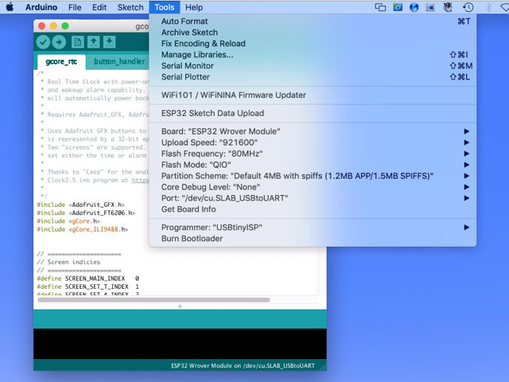
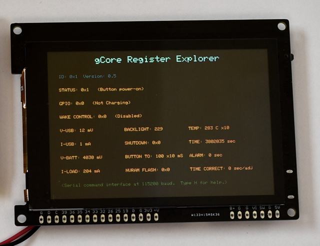
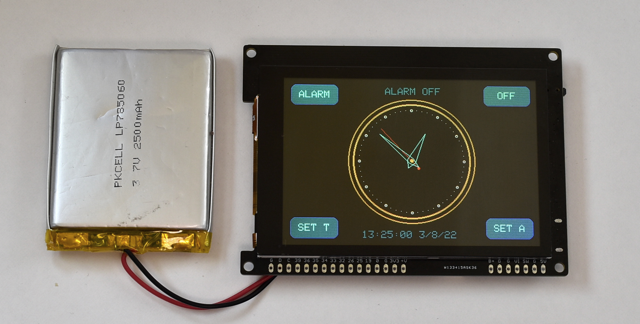
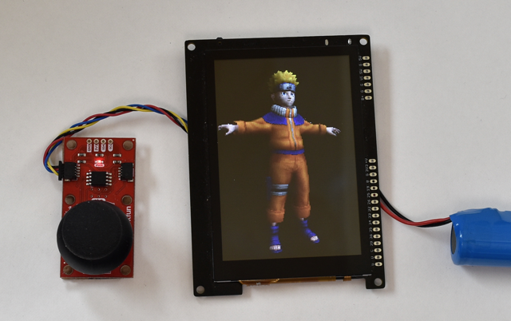
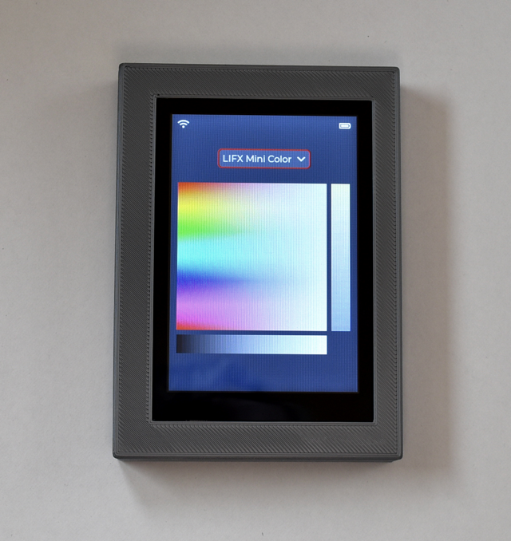

## gCore Arduino Library

### Arduino Library
Copy the ```gCore``` directory into your Arduino libraries folder.

1. ```gCore``` contains a class that interfaces with the EFM8 co-processor and includes time functions.
2. ```gCore_ILI9488``` contains an Adafruit compatible display driver for gCore's ILI9488 LCD controller.  It can be used anywhere an Adafruit driver would be used.  It is not as fast as the TFT\_eSPI library but provides a good example of how to interface with the ILI9488, including setup code.

### Other libraries ported to gCore
There are other libraries, in addition to the gCore library, that have been ported to support gCore or are used by the gCore demos.

#### TFT_eSPI Port
I configured a version of Bodmer's fantastic [TFT\_eSPI](https://github.com/Bodmer/TFT_eSPI) library to support gCore as an Adafruit compatible LCD driver.  It is incredibly fast and even though I wrote my own ILI9488 library I'd advise using this when possible.  I put this version in its own repository [here](https://github.com/danjulio/TFT_eSPI).  Download and install it as an Arduino library.  You may have to temporarily move aside any other version of TFT_eSPI you have when you compile for gCore.

### LIFX
I extended Peter Hum's excellent [LIFX](https://github.com/peter-hum/LIFX) library to support color capable bulbs as well as to be able to query the bulb and identify it and its capabilities.  I put this version in its own repository [here](https://github.com/danjulio/LIFX).  Use this version with the ```lifx_controller``` demo.

### lv_arduino
The ```lv_conf.h``` file used to configure LVGL for the ```lifx_controller``` demo may be found in the ```supporting``` subdirectory here.

### tgx
Because it appears that Arvind Singh is continuing to evolve his amazing 3D [tgx](https://github.com/vindar/tgx) library, I have included the copy of that library I used for the ```joystick_3d``` demo in case the API changes.  This can be found in the ```supporting ``` subdirectory here.

### Demo Programs
Demo program show off various aspects of gCore.  They require additonal libraries listed with each demo description.  The Arduino environment needs to have the ESP32 addition installed and configured for the Wrover Module as shown below.



#### CapTouchPaint
A port of the Adafruit CapTouchPaint program.  Uses the following libraries.

1. gCore
2. gCore_ILI9488
3. Adafruit_GFX (available in Library manager)
4. Adafruit_FT6206 (available in Library manager)

#### eTFT_graphicstest
A port of the Adafruit ```graphicstest``` benchmark program using the TFT\_eSPI library.  Blazing fast.  Uses the following libraries.

1. Adafruit_GFX
2. TFT_eSPI (see above for a link to my version)

#### gcore\_reg_explorer
A demo program that displays the EFM8 registers, dynamically updated, and provides a command line interface through the serial monitor allowing access to the registers and NVRAM.  Designed to allow easy modification of register values to explore how the EFM8 co-processor works (see the ```Documentation``` directory for address offsets and a description of the registers).  Demonstrates how to use the ```gCore``` library to access the EFM8.



Configure the Arduino Serial Monitor for 115200 baud operation.  Type 'H' followed by Send to display a help menu.

Uses the following libraries.

1. gCore
2. gCore_ILI9488
3. Adafruit_GFX

#### gcore_rtc
A demo program that displays a clock to demonstrate use of the EFM8's RTC and Alarm functions.  Use a simple touch interface to set the time and an alarm, then turn gCore off and watch it automatically switch back on when the alarm time passes.



Uses the following libraries.

1. gCore
2. gCore_ILI9488
3. Adafruit_GFX
4. Adafruit_FT6206

#### graphicstest
The Adafruit ```graphicstest``` benchmark program using my gCore\_ILI9488 LCD driver.  No slouch compared to other ILI9488 driver's I played with but not as fast as TFT_eSPI.  Uses the following libraries.

1. Adafruit_GFX
2. gCore_ILI9488

#### joystick_3d
A port of Arvind Singh's Naruto demo using his tgx 3D graphic library.  Spin around a model of the character Naruto Uzumaki displayed as a 3D surface with or without a texture map or shading. Makes use of tasks running on both CPUs to improve performance.  Supports an optional Sparkfun [I2C joystick](https://www.sparkfun.com/products/15168) plugged into the Qwiic interface to manually control the view (pan/zoom/switch shaders).



Uses the following libraries.

1. gCore
2. Sparkfun\_Qwiic\_Joystick\_Arduino\_Library (available in Library manager or from the product page)
3. TFT_eSPI (see above for a link to my version)
4. tgx (available in ```supporting ```)

#### lifx_controller
A demo remote control application that connects to Wifi and discovers any [LIFX](https://www.lifx.com/) LED light bulbs that have also been configured on that Wifi.  It then uses the [LVGL](https://lvgl.io/) graphics library to display a GUI interface that may be used to control the bulbs.  A drop-down menu lists all discovered bulbs. Selecting a bulb displays an appropriate touch control interface for the bulb.  For example a color-temperature dimmable white bulb will display a brightness and color temperature graphic.  Touching on the graphic controls the bulb.  A color capable bulb displays a color picker, brightness and color temperature graphics.



Be sure to set your Wifi credentials in the USER CONFIGURATION section of the ```lifx_controller.ino``` file.  You should have one or more LIFX LED bulbs previously setup on the same Wifi.

Also be sure to replace the default ```lv_conf.h``` file in the LVGL Arduino library with the version in the ```supporting``` directory here.  This configures LVGL to the correct resolution and portrait orientation used by the demo.

Uses the following libraries.

1. gCore
2. LVGL for Arduino ([lv_arduino](https://github.com/lvgl/lv_arduino))
3. LIFX (see above for a link to my version)
4. TFT_eSPI (see above for a link to my version)

Note that I linked to an obsolete version of the LVGL for Arduino library.  This is because I know this one works.  It may be that the version available through the Arduino library manager also works (but you'll still have to install the ```lv_conf.h``` file.

#### sd_benchmark
A port of the [ESP32\_SD_Benchmark](https://github.com/moononournation/ESP32_SD_Benchmark) program to gCore.  This test writes and reads a 4MB file to the Micro-SD Card using different block sizes for each communication method (SPI bus, 1-bit data mode, 4-bit data mode).  I found that I couldn't easily switch between communication methods so the test power-cycles gCore between the tests run with each method using the RTC/Alarm capability.  Output is displayed via serial in the Arduino monitor (115200 baud).  Be sure to open the monitor before downloading and running.

Uses the following libraries.

1. gCore
2. SD, SD_MMC, FS (built-in)

I expect performance will vary with the type of card.  Tests with a Sandisk Extreme 32GB (UHS Speed class) are shown below.  The 4-bit mode pays off when writing files.


Write Performance

| Blocksize | HSPI | 1-bit | 4-bit |
| --- | --- | --- | --- |
| 1K | 264 KB/s | 426 KB/s | 439 KB/s |
| 2K | 460 KB/s | 878 KB/s | 937 KB/s |
| 4K | 893 KB/s | 1674 KB/s | 2135 KB/s |
| 8K | 1198 KB/s | 2386 KB/s | 3676 KB/s |
| 16K | 1472 KB/s | 3187 KB/s | 6105 KB/s |
| 32K | 1629 KB/s | 3689 KB/s | 8905 KB/s |
| 64K | 1632 KB/s | 3742 KB/s| 9039 KB/s |

Read Performance

| Blocksize | HSPI | 1-bit | 4-bit |
| --- | --- | --- | --- |
| 1K | 776 KB/s | 907 KB/s | 1049 KB/s |
| 2K | 776 KB/s | 913 KB/s | 1056 KB/s |
| 4K | 774 KB/s | 923 KB/s | 1068 KB/s |
| 8K | 771 KB/s | 921 KB/s | 1068 KB/s |
| 16K | 761 KB/s | 932 KB/s | 1084 KB/s |
| 32K | 749 KB/s | 932 KB/s | 1082 KB/s |
| 64K | 751 KB/s | 932 KB/s| 1083 KB/s |
