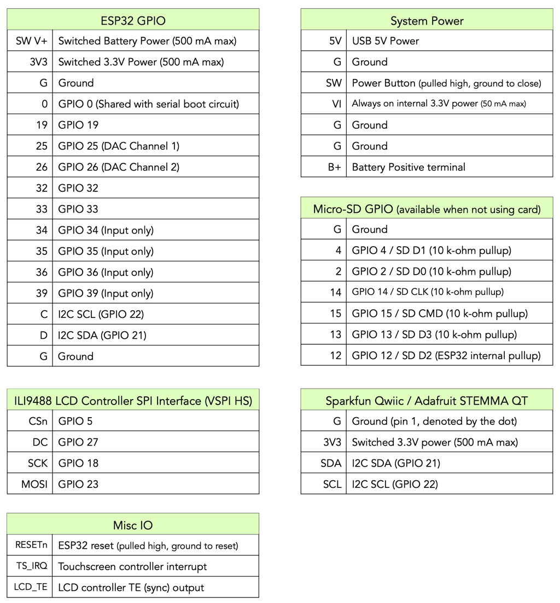

## gCore Documentation
This directory contains gCore documentation with PDF files stored in the ```Documents``` directory.

### gCore Subsystems


1. CPU - Dual-core ESP32 with 16 MB Flash and 8 MB PSRAM.
2. Display - 480 x 320 pixel TFT LCD with ILI9488 controller, FT6236 capacitive touchscreen and PWM-based backlight control.  SPI-to-Parallel converter allows operation of the Display SPI peripheral at up to the maximum 80 MHz.
3. EFM8 - Co-processor providing Real Time Clock (RTC) with alarm, power-management, internal voltage and current monitoring, and 4096 bytes of NVRAM with 1024 bytes flash backup.
4. Micro-SD - Mass storage with high speed 4-bit data.
5. Power - 3.7V Li-Ion/LiPo with power-path charger and regulated 3.3V output.
6. USB Interface - CP2102 USB UART with auto-programming (Reset/GPIO0 boot mode entry) control.


### Power Control
gCore generates two internal 3.3V rails.  One that powers the EFM8 co-processor and is always on, and one switched by the EFM8 that powers the rest of gCore and user application circuitry.  gCore also makes a switched rail from the Charge Controller (raw battery voltage) available.  Total current from both the switched 3.3V and switched raw battery outputs, used by both gCore and user circuitry, should be approximately 1A or less.

gCore can be turned on by multiple sources.

1. Power Button Press - Pressing the button for a configurable time (20 mSec - 2.5 seconds) always switches power on.
2. RTC Alarm - An alarm value can be set in the EFM8 RTC that will turn on gCore when the Alarm time is reached.
3. Charge Start and/or Charge End - The EFM8 can be configured to turn on when charging starts or completes (full battery).

It can also be turned off by multiple sources.

1. ESP32 initiated - Code running on the ESP32 can switch power off using the EFM8.  Short Power Button Presses can be used by code for soft power off.
2. Long Power Button Press - A long Power Button press (~5 seconds) will switch power off regardless of the code running on the ESP32.
3. Critical Battery Voltage - The EFM8 switches power off if the battery voltage falls below 3.3V.  A warning is available to code running on the ESP32 prior to power off.

The EFM8 prevents power on if the battery voltage is 3.5V or less.

### Display
#### LCD Controller
The ILI9488 LCD controller is configured with an 8-bit parallel interface.  A serial-to-parallel converter connects the LCD controller to the ESP32 VSPI peripheral dedicated pins.  This allows driving the LCD controller at the maximum SPI clock rate of 80 MHz.


There are some specific timing requirements, described below, that must be followed.

| Specification | min | max |
| --- | --- | --- |
| CSN asserted before first rising edge of SCLK | 20 nS | |
| CSN hold after final edge of SCLK | 100 nS | |
| MOSI setup to rising edge of SCLK | 4 nS | |
| MOSI hold after rising edge of SCLK | 2 nS | |
| DC asserted before CSN asserted | 0 nS | |
| DC hold after final edge of SCLK | 100 nS | |

Primarily the CSN signal must be de-asserted after the final SCLK rising edge.  This is handled automatically by the Arduino gCore LCD driver and the ported eSPI_TFT libraries but must be specified as shown below when configuring the VSPI peripheral directly in the IDF.

```
	spi_device_interface_config_t devcfg={
            .clock_speed_hz=80000000,
            .mode=0,
            .spics_io_num=5,
            .queue_size=1,
            .pre_cb=NULL,
            .post_cb=NULL,
            .cs_ena_pretrans = 12,            // Make sure CS brackets transaction with enough
            .cs_ena_posttrans= 12,            //   time for setup/hold on serial-parallel circuit
            .flags = SPI_DEVICE_HALFDUPLEX
    };
```

#### Backlight
The LCD backlight is driven by a constant current source providing constant brightness over the full operating range of battery voltage.  Backlight brightness is controlled by a PWM output on the EFM8 co-processor and can be controlled by code running on the ESP32.  The PWM frequency is about 24 kHz.

#### Touchscreen Controller
The FT6236 capacitive touchscreen controller is an I2C device and well supported by existing drivers for both the Arduino and IDF environments.  The controller has a 7-bit I2C address of 0x38.  gCore demo software polls the controller but an interrupt pin is also available (see Misc IO below).

### Charge Management
A Microchip MCP73871 load sharing charge controller supplies 500 mA charge current to a standard 2 mm JST connector for a 3.7V Li-Ion or LiPo battery (4.2V max charge voltage).  Positive and negative battery terminal locations align with batteries sold by suppliers such as Adafruit and Sparkfun.  A jumper option allows increasing charge current to 1A (this may violate the USB limits on some computer USB ports).  The charge controller provides autonomous power source selection using USB power when available and automatically switching to battery when USB power is not available or augmenting USB power with battery power if necessary.  A safety timer shuts down charging if the battery is not charged within six hours.  A 1.5A PTC fuse is connected in series with the battery for protection.

The Charge LED provides the following status.  The status is also available to code running on the ESP32.

1. Off - No USB Power.  gCore powered by the battery.
2. On Solid - USB supplying power.  Battery charged.
3. Slowly pulsing on and off - USB supplying power.  Battery charging.
4. Blinking - USB supplying power. Charge Fault detected (e.g. safety timer expired).

gCore is designed to work with batteries from 500 mAh to about 4 Ah capacity.  The battery must be able to take the selected full charge current and be capable of being charged within the 6 hour safety timeout implemented by the charge controller.

### GPIO Utilization
ESP32 GPIO available to the user and used by gCore are shown below along with power and miscellaneous signals.




### Micro-SD
The Micro-SD socket is configured to use the ESP32 4-bit data mode interface (SD driver).  It may also use the 1-bit data mode or be treated as a SPI device (using the ESP32 HSPI peripheral).  The GPIO12-15 signals double as a JTAG debugging port when no Micro-SD Card is installed.

The ```SD_MMC``` class is used in the Arduino environment to configure 1- or 4-bit data modes as shown below.

```
	#include <SD.h>
	#include <SD_MMC.h>
	
	void setup() {
		// Select only one of the following begin statements
		
		// 4-bit data mode
		if (!SD_MMC.begin()) {
		    Serial.println("ERROR: SD card mount failed!");
		}
		
		// 1-bit data mode
		if (!SD_MMC.begin("/sdcard", true)) {
		    Serial.println("ERROR: SD card mount failed!");
		}
	}
```

### EFM8 Operation
The EFM8 co-processor performs a variety of functions for gCore.  It operates independently from the ESP32 but may be controlled by the ESP32 through a register-based I2C interface.

1. Power Management - Power Button monitoring, soft power control, critical battery voltage shut off.
2. Charge Monitoring - Provides charge status to the ESP32, controls the charge LED.
3. Real Time Clock with Alarm - Stores real time as a 32-bit integer incremented each second with an alarm function that can be used to switch power on.  gCore library functions store epoch time and provide conversion functions to/from standard time units.
4. Internal current and voltage monitoring - Monitor and make available USB voltage and input current, battery voltage and load current to the ESP32.
5. Non-volatile RAM with partial flash backup - Provides 4096 bytes of NVRAM for use by the ESP32 to store information that can survive ESP32 power cycles.  The NVRAM is maintained as long as the EFM8 has power (battery installed).
6. Provides 1024 bytes of flash-based storage that can survive EFM8 power cycles (battery removal).
7. Backlight brightness control - Set backlight PWM value.
8. Micro-SD card detection - Monitors the Micro-SD card present switch as status for the ESP32.

The ```gCore``` Arduino library contains functions for accessing the EFM8 from ESP32 code.

#### I2C Interface
The EFM8 I2C interface has a 7-bit address of 0x12.  The maximum frequency for the I2C bus is 100 kHz (including communication with the FT6236 touchscreen controller and any user I2C peripherals).

Registers and NVRAM are addressed using a 16-bit address.

Register write cycles are shown below.


Register read cycles are shown below.


#### Register Map

| Register | Register Address | Size | Type | Description |
| --- | ---| --- | --- | --- |
| NVRAM | 0x0 - 0x3FF | 8-bit | RW | Non-volatile RAM with Flash backup |
| | 0x400 - 0xFFF | 8-bit | RW | Non-volatile RAM |
| ID | 0x1000 | 8-bit | RO | Firmware ID |
| VER | 0x1001 | 8-bit | RO | Firmare Version |
| STATUS | 0x1002 | 8-bit | RO | Device Status |
| GPIO | 0x1003 | 8-bit | RO | GPIO Input Signal Values |
| VU | 0x1004 | 16-bit | RO | USB Voltage (mV) - unsigned |
| IU | 0x1006 | 16-bit | RO | USB Current (mA) - unsigned |
| VB | 0x1008 | 16-bit | RO | Battery Voltage (mV) - unsigned |
| IL | 0x100A | 16-bit | RO | Load Current (mA) - unsigned|
| TEMP | 0x100C | 16-bit | RO | EFM8 internal temp (°C x 10) - signed |
| BACKLIGHT | 0x100E | 8-bit | RW | Backlight PWM Value (0-255) - default 128 |
| WAKE_CONTROL | 0x100F | 8-bit | RW | Automatic Power-on Control |
| SHUTDOWN | 0x1010 | 8-bit | WO | Power-off trigger |
| PWR\_BTN_TIME | 0x1011 | 8-bit | RW | Power Button short press detection time (mS x 10) - default 100 |
| NV_CONTROL | 0x1012 | 8-bit | RW | NVRAM Flash Storage control |
| TIME | 0x1013 | 32-bit | RW | Real Time Clock value (seconds) - unsigned |
| ALARM | 0x1017 | 32-bit | RW | Real Time Clock Alarm value (seconds) - unsigned |
| TIME_CORRECT | 0x101B | 32-bit | RW | Real Time Clock correction value - signed |

##### ID Register
The ID is 1.

##### Version Register
The Version Register contains two fields.

| Bits | Description |
| --- | --- |
| 7:4 | Major Revision (0-15) - Incremented for new user-visible functionality |
| 3:0 | Minor Revision (0-15) - Incremented for bug fixes |

##### Status Register
The Status register contains the following status information.

| Bits | Description |
| --- | --- |
| 7 | Critical Battery Detected - Battery voltage is 3.3V or less and power will be switched off within ten seconds |
| 6:5 | Reserved.  Read as 0 |
| 4 | Power Button Short Press detected - The Power Button was pressed longer than the period configured in the PWR\_BTN_TIME register (but shorter than the 5 second hard power-off threshold) and then released. |
| 3 | Reserved.  Reads as 0 |
| 2 | Power On due to Charge Status change (either Charge Start or Charge End as configured in the WAKE_CONTROL register) (latched) |
| 1 | Power On due to RTC Alarm (latched) |
| 0 | Power On due to Power Button Press (latched) |

##### GPIO Register
The GPIO register contains the following real-time status information from EFM8 GPIO pins.

| Bits | Description |
| --- | --- |
| 7:4 | Reserved.  Read as 0 |
| 3 | Micro-SD Card present bit |
| 2 | Power Button currently pressed bit |
| 1:0 | MCP73871 Charge Status bits |

MCP73871 Charge Status values are shown below.

| Status Bit 1 | Status Bit 0 | Charge Status |
| --- | --- | --- |
| 0 | 0 | Not charging |
| 0 | 1 | Charging |
| 1 | 0 | Charge done |
| 1 | 1 | Charge fault |

##### Voltage and Current Registers
The voltage and current registers contain filtered values.  Voltages are in mV (for example 3.9 volts will read 3900).  Current values are in mA (0.5A will read 500).

##### Temperature Register
The Temperature register contains the temperature from a sensor on the EFM8 die output as °C x 10 (for example 22.5°C will read 225).  The value is signed.  The temperature sensor is not particularly accurate.

##### Backlight Register
The Backlight register controls the PWM signal connected to the constant current backlight driver.  A value of 0 will turn the backlight off.  A value of 255 sets the backlight to full brightness (and maximum power consumption).  Since there is a non-linear function between PWM value and perceived brightness, it is often sufficient to set a value lower than 255 to obtain adequate brightness.  Upon power-on (battery attachment) the EFM8 sets this register to 128.

##### Wake Control Register
The Wake Control register enables or disables various power-on wake sources.  The Power Button control of power is always enabled.

| Bits | Description |
| --- | --- |
| 7:3 | Reserved.  Read as 0 |
| 2 | Power on when Charge Complete is detected |
| 1 | Power on when Charging is started (USB Power supplied) |
| 0 | Power on when Time Register matches Alarm Register |

Upon power-on (wake) the EFM8 sets this register to 0.  It is up to code running on the ESP32 to setup subsequent wake conditions.

##### Shutdown Register
The Shutdown register is used to switch power off.  Writing the value 0x0F to this register turns off the switched 3.3V and raw battery supply rails.  Writing any other value has no effect.  Register read values are undefined.

##### Power Button Short Press Time Register
The Power Button Short Press Time register controls the period of time the button must be pressed to detect an ESP32 visible short press.  When power is off, a short press turns power on.  When power is on pressing the button for longer than the specified time and then releasing it sets the Power Button Short Press detected bit in the Status register.  It is set in units of 10 mSec intervals with legal values 2-255 representing 20 mSec to 2.55 seconds.  Upon power-on (battery attachment) the EFM8 sets this register to 100 (for a detection period of 1 second).

##### NV Control Register
The NV Control register is used to trigger a save of the first 1024 bytes of NVRAM to EFM8 flash storage to allow this data to persist over EFM8 power cycles (battery removal), or to read the EFM8 flash storage values into the first 1024 bytes of NVRAM (the remaining 3072 bytes are unaffected).

Writing 0x57 ('W') to the register triggers a write of NVRAM to flash.  Wait at least 36 mSec after triggering the write before accessing the EFM8 as it will not respond to I2C cycles while it is erasing the flash memory in preparation to write to it.

Writing 0x52 ('R') to the register triggers a read of flash into NVRAM.

Writing NVRAM to flash takes up to approximately 128 milliseconds.  The register may be polled (after waiting an initial 36 mSec) to determine when the write is complete.  It will return the value 1 while the write is in progress and the value of 0 when the write is complete.  However it is possible for the I2C read cycle to fail if part of it occurs just as a write is occurring internal to the EFM8.  For this reason code must either be able to deal with a failed reads or just wait 36 + 128 = 164 mSec before accessing the EFM8.

##### Time Register
The Time register contains a value that is incremented every second.  It is designed to work with an epoch time system (starting Jan 1, 1970).  It is an unsigned 32-bit value and, if used with the epoch time system, will roll over in the year 2106.

The time value is latched when a read is initiated to the first (MSB) byte address.  All four bytes should be read in the same I2C transaction.

All four bytes should be written in the same I2C transaction when setting the time.  The time will be updated upon completion of the fourth (LSB) byte.

##### Alarm Register
The Alarm register contains the time that can be used to turn on gCore if the associated bit is set in the Wake Control register.  An alarm occurs when the Time register becomes equal to or greater than the Alarm register.

The Alarm register is updated after the fourth byte is written.

To set an alarm, first set the Alarm register with a time larger then the Time register and then set bit 0 in the Wake Control register.

Upon power-on (battery attachment) the EFM8 sets this register to 0.

##### Time Correct Register
The Time Correct register is used to improve the accuracy of the EFM8 RTC.  It may be written with a signed value specifying a number of seconds between time corrections.  Typically it would be written by software after observing the accuracy of the RTC over a long period of time.

A positive value is used to correct a slow RTC.  A value of 1 is added to the Time Register every time the number of seconds in the Time Correct register passes.  For example if the Time Correct register contains the value 5 then the Time register might increment as follows: 1 2 3 4 6 7 8 9 11 ... (obviously the Time Correct value will be a much larger number of seconds).

A negative value is used to correct a fast RTC.  A value of 1 is subtracted from the Time Register every time the absolute value of the number of seconds in the Time Correct register passes.

Upon power-on (battery attachment) the EFM8 sets this register to 0.  A value of 0 has no effect on the Time register (performs no correction).

#### NVRAM / Flash Storage
The EFM8 provides 4096 bytes of NVRAM at address offset 0 - 0x0FFF.  This RAM is maintained as long as the EFM8 has power (battery attached).  It may be used by the ESP32 to store persistent values if the application does not want to use the ESP32's built-in persistent storage mechanisms (for example if the ESP32 flash will often be completely erased).

The EFM8 also provides 1024 bytes of flash memory that can be used to back the first 1024 bytes of NVRAM.  This flash is copied to the first 1024 bytes of RAM when power is applied to the EFM8 (battery attachment).  Code running on the ESP32 can copy the first 1024 bytes of NVRAM back to flash using the NV Control register.  After this the values copied will be restored to NVRAM in the event the battery is disconnected and reconnected.  Code on the ESP32 can also overwrite the NVRAM with the values stored in flash at any time using the NV Control register (for example to restore a previous snapshot of data).

Initially the flash contains the value 0xFF in each byte.  This means after power-on (battery attachment) the first 1024 bytes of NVRAM will contain the value 0xFF and the remaining 3072 bytes of NVRAM will contain the value 0.

Important notes:

1. The EFM8 datasheet specifies a typical erase/write endurance for the flash memory of 30k cycles.  However it also specifies a minimum of only 1k cycles.  This is probably under worst case conditions but you should only copy the NVRAM to flash when necessary.  Avoid implementations that update flash blindly (e.g. when there is no difference between flash and NVRAM).
2. Wait at least 36 mSec after triggering a copy of NVRAM to flash memory using the NV_CONTROL register before accessing the EFM8 as it will not respond to I2C cycles while it is erasing the flash memory in preparation to write to it.
3. During the process of writing the NVRAM to flash the EFM8 will occasionally become unresponsive (during the actual flash write) and it is possible I2C cycles to it will fail.  The writing process takes a maximum of 128 mSec so it may just be easier to wait for 36 + 128 = 164 mSec after triggering the write operation before accessing the EFM8 again.


### Dimensions

