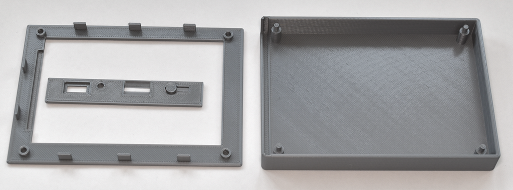
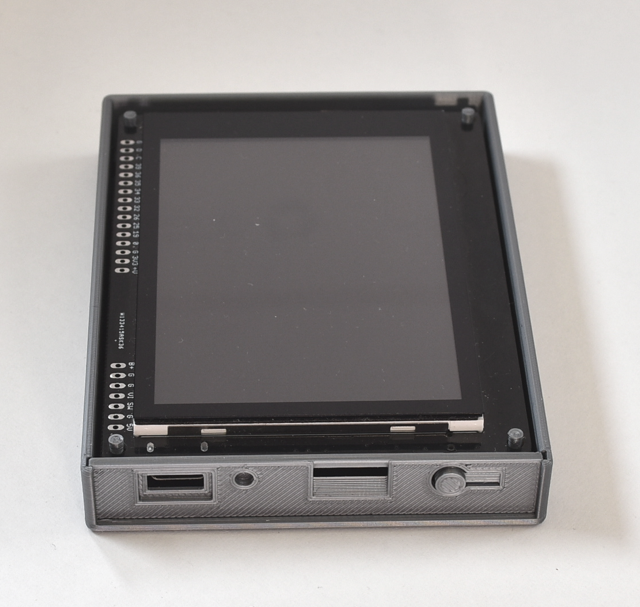
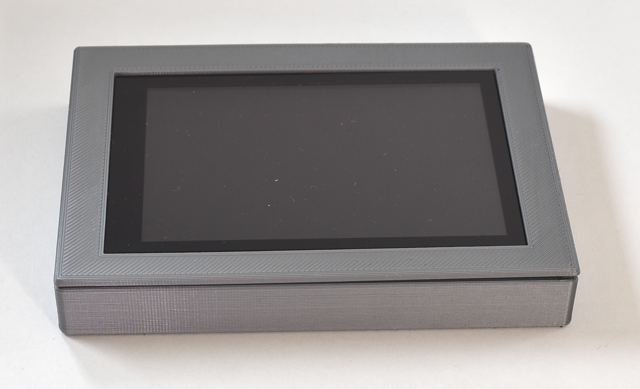
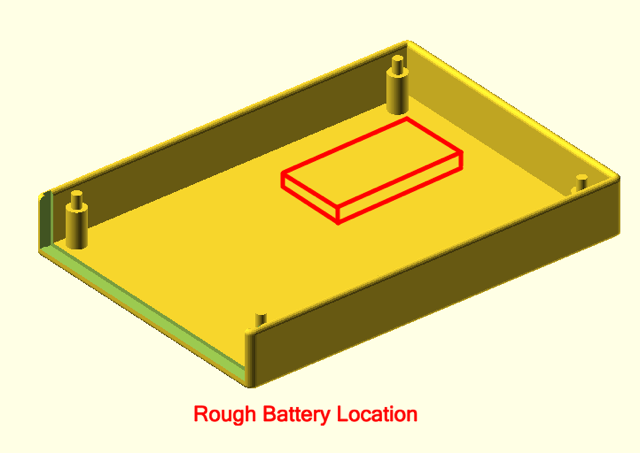

## gCore 3D Printed Enclosures
This directory contains designs and STL files for slicing and printing on a FDM printer.  Design made using [OpenSCAD](https://openscad.org/).  To the mechanical engineers and 3D modeling pros out there: Apologies in advance for my terrible coding...

1. ```handheld_1_fdm``` contains the design for a snap-together handheld enclosure designed to hold gCore and a flat LiPo battery.
2. ```openscad_libraries```.  A copy of Ryan Colyer's OpenSCAD support functions and a gCore model used by the enclosure designs.  This directory and the design directories must be in the same relative position when opening the OpenSCAD design.

### handheld\_1_fdm
This enclosure is for remote control type applications.  Dimensions are approximately 105 x 75 x 17 mm.  It snaps together and is designed to use a flat LiPo battery like the Sparkfun [1000 mAh model](https://www.sparkfun.com/products/13813) (battery height of 6mm or less).  The battery can be attached to the bottom of the case as shown below using double sticky tape.  It may be helpful to include a skirt when slicing the enclosure base to prevent slight warping during the print.







