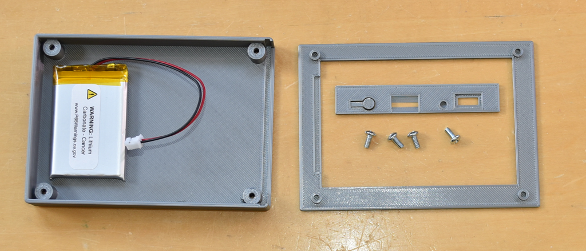
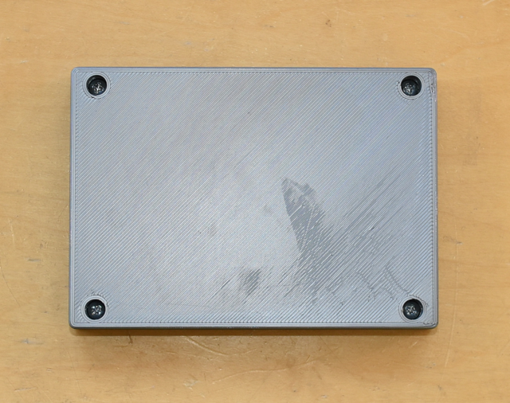
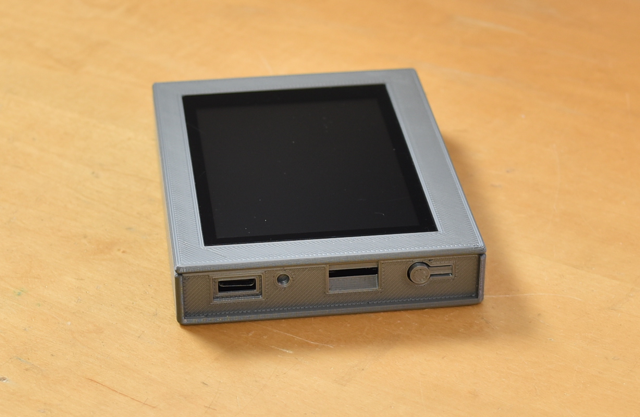

## gCore 3D Printed Enclosures
This directory contains designs and STL files for slicing and printing on a FDM printer.  Design made using [OpenSCAD](https://openscad.org/).  To the mechanical engineers and 3D modeling pros out there: Apologies in advance for my terrible coding...

1. ```handheld_1_fdm``` contains the design for a snap-together handheld enclosure designed to hold gCore and a flat LiPo battery.  It works reasonably well with a good 3D printer.
2. ```handheld_2_fdm``` contains a second version that is held together using 4x 4-40 x 0.25 inch (or metric equivalent) pan-head screws.  This design works very well.
3. ```openscad_libraries```.  A copy of Ryan Colyer's OpenSCAD support functions and a gCore model used by the enclosure designs.  This directory and the design directories must be in the same relative position when opening the OpenSCAD design.

These enclosures are for remote control type applications.  Dimensions are approximately 105 x 75 x 17 mm.  They are designed to use a flat LiPo battery like the Sparkfun [1000 mAh model](https://www.sparkfun.com/products/13813) (battery height of 6mm or less).  The battery can be attached to the bottom of the case as shown below using double sticky tape.  It may be helpful to include a skirt when slicing the enclosure base to prevent slight warping during the print.  It may also be necessary to shave extra material from the mounting posts and to drill out the screw holes in the ```handheld_2_fdm``` design to clear stray plastic threads.

### handheld\_2_fdm






### handheld\_1_fdm


