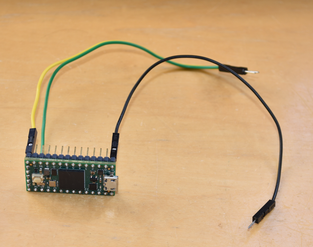

## gCore EFM8 Firmware
This directory contains the source code and compiled hex for the EFM8 RTC/PMIC co-processor on gCore.  It was created using Silicon Labs Simplicity Studio v4.

### Sept 2023 - Version 1.2
Version 1.2 fixes two bugs with the Real Time Clock (RTC) in the originally shipped version 1.1 firmware.

1. The once/second RTC interrupt is controlled by a timer.  The timer preset was incorrectly set and led to a time keeping error of -0.0061% (the RTC was slightly slow).
2. The once/second RTC interrupt could be missed on occasion with heavy I2C access to the EFM8 (for example polling the EFM8 several times per second to see if the power button has been pressed).  This could lead to a far more severe time keeping error of up to tens of seconds per day depending on the I2C access frequency.

There are no other known issues with version 1.1 firmware (e.g. there is no problem if you don't use the RTC or can live with the bugs).  Boards are currently shipping with version 1.2 firmware.

### Upgrading Version 1.1 gCore boards
For customers with gCore boards containing version 1.1 firmware and experiencing issues with the RTC there are three ways to get the new firmware loaded on your board.

1. Email me to arrange return and reprogramming.  You will pay the shipping to me and I will pay the return shipping.
2. Install Silicon Labs Simplicity Studio if you have a Silicon Labs USB Debug Adapter and use the programming tool to program the hex from this repository.  The tool can be run from within Simplicity Studio but you need to configure it for an EFM8SB20F32G micro-controller.
3. Update the firmware yourself with the instructions below and a 32-bit Arduino board.

You can tell what firmware you are using by running the ```gcore_reg_explorer``` demo Arduino sketch in the ```Arduino/gCore/examples``` folder in this repository.  You will see a line of text identifying the version on the gCore display.

```
	ID: 0x01  Version: 1.1
```

#### Local Firmware Update
The ```gcore_efm8_upd_1_2``` folder contains an Arduino sketch that contains the new firmware and code capable of programming the gCore EFM8 through a Silicon Labs C2 interface exposed via test points on gCore.  The sketch is designed to run on a 3.3V 32-bit Arduino development board and has been tested on the following boards.

1. PJRC Teensy 3.2 using Teensyduino 1.56
2. PJRC Teensy 4 using Teensyduino 1.56
3. Sparkfun ESP32 Thing Plus using Espressif ESP32 for Arduino version 2.0.9
4. Espressif ESP32-S3-DevKitC-1 using Espressif ESP32 for Arduino version 2.0.9
5. Waveshare RP2040 Zero using Earle Philhower’s Raspberry Pi Pico/RP2040 version 3.4.1

The C2 interface has some timing restrictions and various Arduino implementations have wildly different GPIO performance so unfortunately I cannot guarantee operation on any other board (although different Teensy 3/4, ESP32 and RP2040 boards will probably work).

Three wires connect the Arduino to gCore and programming only takes a few seconds after the sketch is compiled and downloaded to the Arduino board.

You should only attempt this if you understand how to compile Arduino sketches for different boards and can connect wires between the two boards.  Please read through the following instructions before attempting the update.

You will need some connecting wire, ideally three Dupont style wires with male and female ends.



You will be connecting to the gCore EFM8 ICSP test points.


#### Compile gcore\_efm8\_upd\_1_2

1. Either update your local copy of this repository or download a zip file of the repository to get the sketch on your computer.
2. Open the Arduino IDE and select your board type.
3. Configure the build environment for your board as discussed below under Board Specific Configuration.
4. Connect your Arduino board and select its serial port.
5. Load the sketch into Arduino. See the note below about selecting GPIO pins on your Arduino.
6. Compile and download the sketch.
7. Open the Arduino Serial Monitor and set it to 115200 baud.  Type the character 'H' in the Serial Monitor and hit send.  You should see the following message displayed in the Serial Monitor.

```
	gCore EFM8 version 1.2 firmware updater sketch
```

##### Board specific configuration

Teensy board have the following setup.  Important to get the right optimization level.

| Board | Setup |
| --- | --- |
| Teensy 3.2 | Optimization: "Faster", CPU Speed: 96 MHz |
| Teensy 4 | Optimization: "Faster", CPU Speed: 600 MHz |
| ESP32 | Flash Frequency: 80 MHz |
| ESP32-S3 | Flash Mode must match your module type (for example use OPI 80 MHz if you have an 8-bit Flash memory) |
| RP2040 | Optimization: "Optimize Even More (-O3)", CPU Speed: 133 MHz |

##### Selecting GPIO pins
By default the sketch uses the following two GPIO pins for the C2 interface.

1. GPIO 12 for the C2 Data (connects to the 'D' pad on gCore)
2. GPIO 14 for the C2 Clock (connects to the 'C' pad on gCore)

You can change these pins if necessary in the sketch under the Pin Definition section in the first tab to match ones available on your board.  Make sure the pins are capable of digital IO.  They should be 3.3V logic levels.

You also need to connect a common ground reference between the Arduino and gCore.


#### Connect the Arduino to gCore
The method described here requires no soldering but does require a steady hand (don't worry I did it a lot while testing this update method).  It also assumes your Arduino board has headers for the Dupont wires or they are soldered to it.

1. gCore should be powered by a connected battery or a USB-C cable but turned off (the EFM8 is always powered when gCore has power).
2. Plug the three Dupont cable female ends onto your Arduino board.  One wire should plug into a Ground (GND) pin and the other two wires into the two GPIO pins implementing the C2 interface.
3. Place the Arduino and gCore next to each other.  Hold the three male ends together in the order 'C' - 'D' - GND and press them onto the gCore EFM8 ICSP pads as shown in the pictures below.  Make sure they are contacting the pads.  They should poke through any oxide layer but you might clean the pads with Isopropyl alcohol on a Q-tip prior to updating.


#### Update
While holding the male ends against gCore's test points, type the character 'P' in the Arduino Serial Monitor and hit Send to start programming (it might be easier to type the P in first so you only have to click Send).  You should see the update process start.  It will complete in just a few seconds.


You can then disconnect the wires from gCore.  It will be running the new firmware.

#### Errors
The sketch will display an error message if any part of the programming sequence fails.  Most likely this is because of a poor connection or lack of power.  It's also possible if there's some issue with the GPIO performance on your Arduino board.  Although the EFM8 may be erased there should be no way to brick it so don't be afraid to try again.  In the worst case you can arrange re-programming with me.

#### Soldering
It's also possible to solder the Arduino wires to gCore as shown in the following image.  Use a fine wire (I love 30 AWG silicon sleeve wire) and small amounts of solder.  Be sure both the Arduino and gCore are unpowered while soldering and unsoldering.  Take care unsoldering as it is easy to pull the test points off the PCB.


