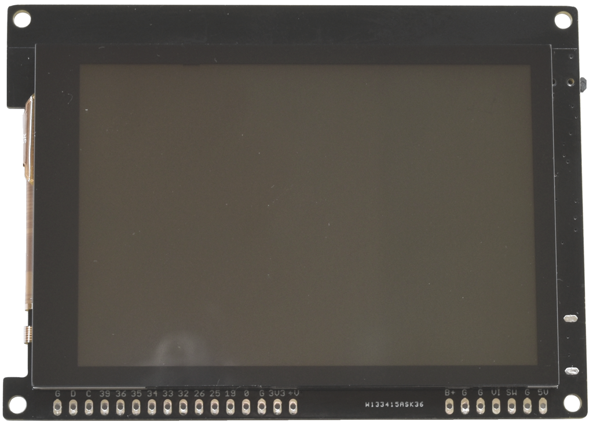

## gCore - gadget Core

 
This repository contains documentation and example code for an ESP32-based development board I designed to enable building portable GUI-based gadgets (*).  It provides a rich feature set and high performance operation enabling, I hope, all kinds of cool and useful devices such as remote controls, instrument controllers and game platforms.  Code may be written using the ESP32 Arduino environment or with Espressif's IDF.  I hope to make it available soon.

(gCore controlling LIFX LED light bulbs via Wifi)

### Supporting documentation and code
This respository contains documentation, an Arduino library with example code, and designs for 3D printed enclosures.

### Support in other Github repositories
Demos and ports of other software to gCore are stored in the following additional repositories to reduce the size of this repository.

### (*) Historical Note
This is actually my second design.  The original gCore design was based around a "feather" PCB designed to fit under an Adafruit LCD module.  It is documented in the [Original gCore](https://github.com/danjulio/gCore) respository and is why this repository is called gCore2.