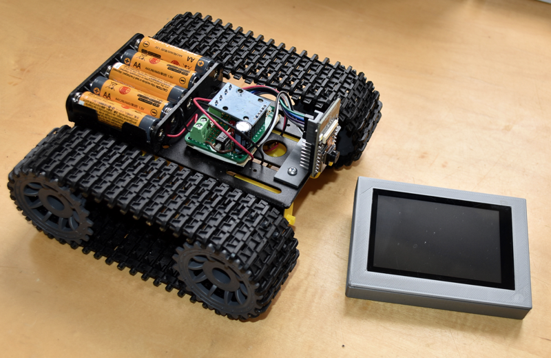

## gCore - gadget Core

 
This repository contains documentation and example code for an ESP32-based development board I designed to enable building portable GUI-based gadgets (*).  It provides a rich feature set and high performance operation enabling, I hope, all kinds of cool and useful devices such as remote controls, instrument controllers and game platforms.  Code may be written using the ESP32 Arduino environment, Espressif's IDF or MicroPython.  Both Adafruit-compatible and [LVGL](https://lvgl.io) LCD drivers are available.

gCore can be purchased from [tindie](https://www.tindie.com/products/globoy/gcore-high-end-esp32-graphics-dev-board/).

(tCam thermal imaging camera)

(POTS telephone to bluetooth adapter)

(Controlling LIFX LED light bulbs via Wifi)

("Nixie" Desk clock)

### Supporting documentation and code
This repository contains documentation, firmware, an Arduino library with example code, and designs for 3D printed enclosures.

### Support in other Github repositories
Additional demos and ports of other software to gCore are stored in the following additional repositories to reduce the size of this repository.

1. [TFT_eSPI](https://github.com/danjulio/TFT_eSPI) - A fork of Bodmer's LCD driver library ported to gCore to maximize LCD drawing performance for Arduino programs.  Very fast.
2. [tCam](https://github.com/danjulio/tCam) - Assembly instructions and firmware for the tCam thermal imaging camera.
3. [MicroPython](https://github.com/danjulio/lv_binding_micropython) - LVGL binding for MicroPython.
4. [gcore_life](https://github.com/danjulio/gcore_life) - Life running on gCore using LVGL.  Shows how to integrate control for gCore into an ESP32 IDF program.
5. [gcore\_lv\_port_esp32](https://github.com/danjulio/gcore_lv_port_esp32) - The LVGL v7 demo with gCore optimized LCD and touch drivers useful for for ESP32 IDF programs.
6. [gcore_tank](https://github.com/danjulio/gcore_tank) - An easy-to-build remote controlled vehicle with video feed using gCore and the remote control.
7. [gcore\_lv\_music_demo](https://github.com/danjulio/gcore_lvgl_music_player) - The LVGL Music Demo running on LVGL v9.
8. [Galaga](https://github.com/danjulio/gcore_galagino) - A port of Harbaum's Galaga emulator on gCore.
9. [MiniWebRadio](https://github.com/danjulio/ESP32-MiniWebRadio) - A port of schreifbfaul1's internet radio/clock program to gCore.
10. [weeBell](https://github.com/danjulio/weeBell_bluetooth) - A bluetooth to POTS phone adapter running on a gCore [expansion board](https://github.com/danjulio/weeBell_hardware).
11. [Faux Nixie Clock](https://github.com/danjulio/faux_nixie_clock) - Desk clock with web browser control panel.

I wrote a desktop app that encapsulates a compiled version of esptool and can download pre-compiled binaries for most of the demos from my [website](https://danjuliodesigns.com/products/gcore.html) and load them into gCore without needing Arduino or the Espressif IDF.

1. [Linux download](https://danjuliodesigns.com/resources/AppSupport/gcore/gsc_0_2_0_Linux_x86_64.zip) - 64-bit x86 architecture version
2. [Mac OS download](https://danjuliodesigns.com/resources/AppSupport/gcore/gsc_0_2_0_macOS.zip) - 64-bit universal (sadly unsigned so you'll have to authorize it)
3. [Windows download](https://danjuliodesigns.com/resources/AppSupport/gcore/gsc_0_2_0_Windows64.zip) - 64-bit x86 architecture version

### (*) Historical Note
This is actually my second design.  The original gCore design was based around a "feather" PCB designed to fit under an Adafruit LCD module.  It is documented in the [Original gCore](https://github.com/danjulio/gCore-featherwing) repository.
