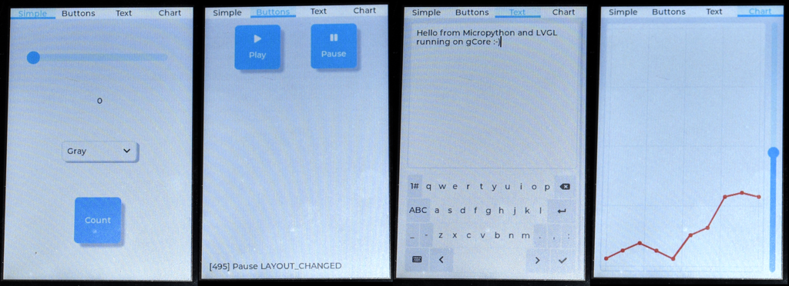

## Micropython + LVGL for gCore
This directory contains documentation and supporting files to build Micropython with LVGL bindings, using the official [lv_micropython](https://github.com/lvgl/lv_micropython) repository, for gCore.  It also contains pre-built binaries (MicroPython v1.19.1 and LVGL v8.3.2).

### ILI9488 Driver
The ```ili9XXX.py``` driver is modified to support gCore.  A new class, ```ili9488g```, is added so that the existing ```ili9488``` class can retain backward compatibility.  The new class has the following modifications.

1. Move default SPI peripheral from HSPI to VSPI.
2. Move default SPI pins to native VSPI pins used on gCore.
3. Change default SPI frequency from 40 MHz to 80 MHz.
4. Add support for 16-bit pixels (RGB565).  The driver automatically works when Micropython is built with either 32- or 16-bit pixels.  The driver is faster when using 16-bit pixels since less data is transferred and the driver doesn't have to copy data for each update (see ```espidf.c```).

Note: As of Dec 20, 2022, this driver has been incorporated in the official lv_micropython project.

### FT6x36 Driver
The existing ```ft6x36.py``` may be used for the touchscreen but needs to be included in the build since it is currently not included by default.  In addition it needs to be specially instantiated to configure it to the necessary 100 kHz I2C clock frequency (since gCore's EFM8 co-processor can't support 400 kHz I2C due to a bug).  See below for instructions to both include it in the build and instance it.

### Building lv_micropython for gCore

#### Modify the repository
First create a local copy of the ```lv_micropython``` repository.  Best to check the current instructions in the repository readme file but basically:

```
git clone https://github.com/lvgl/lv_micropython.git
cd lv_micropython
git submodule update --init --recursive lib/lv_bindings
```

Then replace the ```lib/lv_bindings/driver/esp32/ili9XXX.py``` driver with the ```drivers/ili9XXX.py``` file here.  Make sure the symbolic link in ```ports/esp32/modules/ili9XXX.py``` still points to the updated file.

Finally create a symbolic link from the ```lib/lv_bindings/generic/esp32/ft6x36.py``` file to ```ports/esp32/modules/ft6x36.py``` so that the touchscreen driver will be included in the build.

```
ln -s lib/lv_bindings/generic/esp32/ft6x36.py ports/esp32/modules/ft6x36.py
```


#### Build and load Micropython
First build ```mpy-cross```


```
make -C mpy-cross
```

Then build and download Micropython to gCore.  You can build it with LVGL configured to use either 16-bit RGB565 pixels or 32-bit RGBA8888 pixels (displayed as RGB666 by the ILI9488).

To build 16-bit LVGL:

```
make -C ports/esp32 LV_CFLAGS="-DLV_COLOR_DEPTH=16 -DLV_COLOR_16_SWAP=1" BOARD=GENERIC_SPIRAM PORT=[SERIAL_PORT] deploy
```

To build 32-bit LVGL:

```
make -C ports/esp32 LV_CFLAGS="-DLV_COLOR_DEPTH=32" BOARD=GENERIC_SPIRAM PORT=[SERIAL_PORT] deploy
```

Be sure gCore is turned on before deploying so its serial port will enumerate on your computer to find [SERIAL_PORT].

Connect to gCore after programming using a serial terminal program set to 115200 baud to get the Micropython REPL prompt.  For example using ```screen``` on Linux or Mac OS X.

```
screen [SERIAL_PORT] 115200
```

#### Clean up build
You must clean up the build if you change the python driver before rebuilding.

```
make -C ports/esp32 BOARD=GENERIC_SPIRAM clean
```

### Using the precompiled binaries
There are pre-compiled binaries for 16-bit pixels (```micropython16.bin```) and 32-bit pixels (```micropython32.bin```) in the ```precompiled``` directory here.  They are loaded along with the ```bootloader.bin``` and ```partition-table.bin``` files at the following locations in ESP32 flash memory.

| Location | File |
| --- | --- |
| 0x1000 | bootloader.bin |
| 0x8000 | partition-table.bin |
| 0x10000 | micropython16.bin or micropython32.bin |

If you have the Espressif IDF loaded you can use its tools to download the binaries.  Assuming all three files are in the current directory and you have sourced the ```esp-idf/export.sh``` file.

```
esptool.py esp32 -p [SERIAL_PORT] -b 460800 --before=default_reset --after=hard_reset write_flash --flash_mode dio --flash_freq 40m --flash_size 4MB 0x1000 bootloader.bin 0x10000 micropython16.bin 0x8000 partition-table.bin
```

You can also use the Espressif Windows based download utility to program gCore with the files.

### Super simple LVGL demo
The following code may be entered at the REPL prompt to verify the build.  It will display a simple button that can be pressed.  You should be able to cut and paste the code into your open terminal connection.

```
import lvgl as lv
from ili9XXX import ili9488g
from ft6x36 import ft6x36
disp=ili9488g()
touch=ft6x36(0, 21, 22, 100000)
scr=lv.obj()
btn=lv.btn(scr)
btn.center()
label=lv.label(btn)
label.set_text('Button')
lv.scr_load(scr)

```


### Advanced LVGL demo
The ```demos/advanced_demo_gcore.py``` file is a modified version of the demo provided with the lv_bindings.  It displays several screens under a tab selector with the ability to swipe between pages and is a great way to see the speed-up of using 16-bit pixels.

There are several ways to load code into Micropython but I've found Adafruit's ```ampy``` utility to be easy to use.  Basic installation and usage instructions can be found [here](https://learn.adafruit.com/micropython-basics-load-files-and-run-code).

```
pip3 install adafruit-ampy
```

Once installed the demo can be downloaded to a gCore with Micropython running on it using the following command (assuming the demo is in the current diretory).  Make sure no other python code is running (reset gCore by pressing the RESET button on back).

```
ampy --port [SERIAL_PORT] run advanced_demo_gcore.py
```

You should see the following output and the gCore screen should display the demo.

```
	Single buffer
	ILI9488g initialization completed
	FT6X36 touch IC ready (fw id 0x3 rel 1, lib 1003)
```

